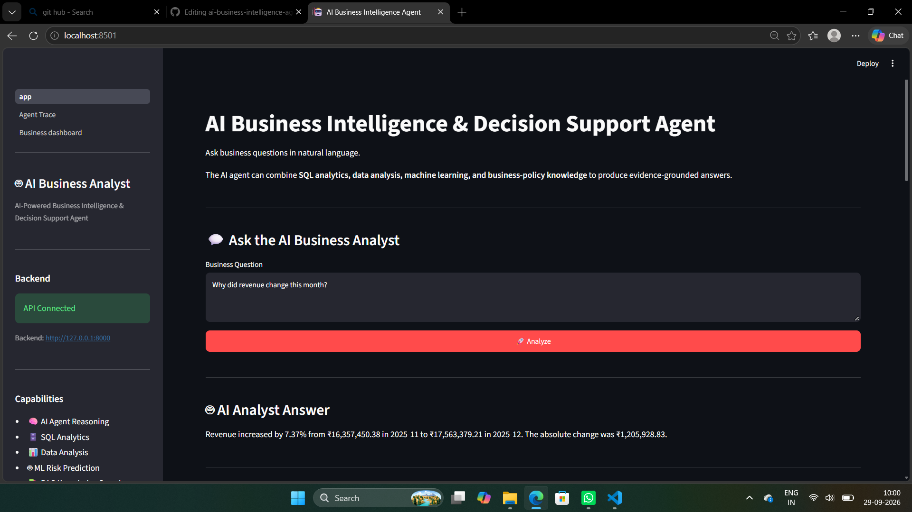
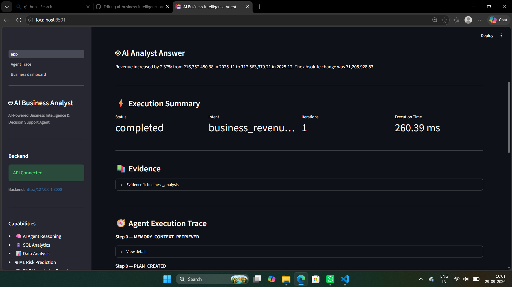
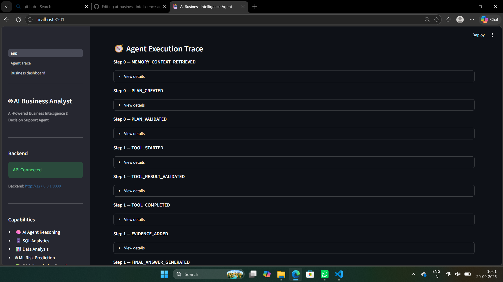
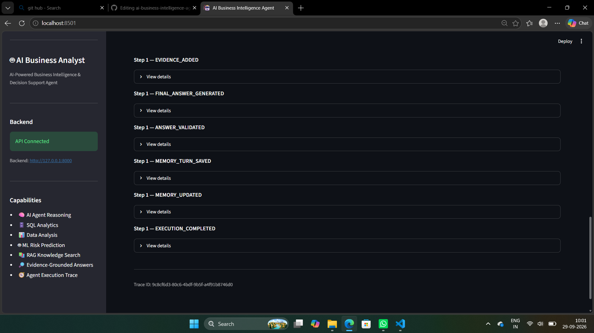
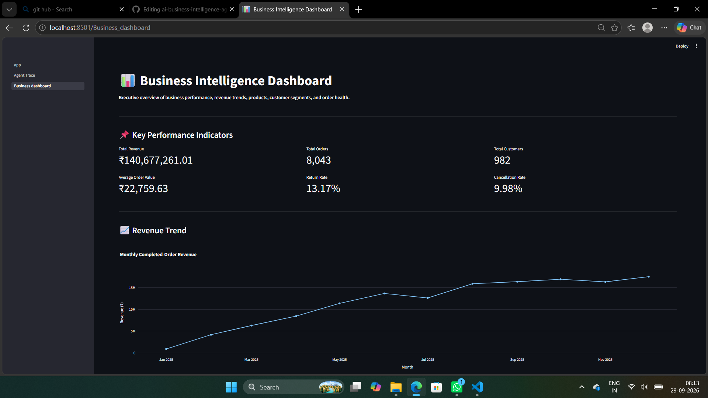
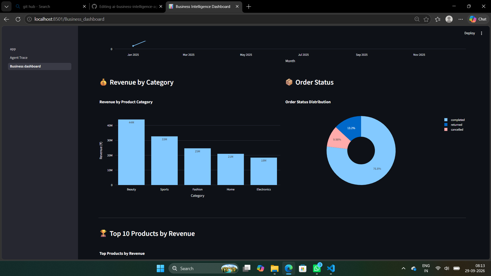
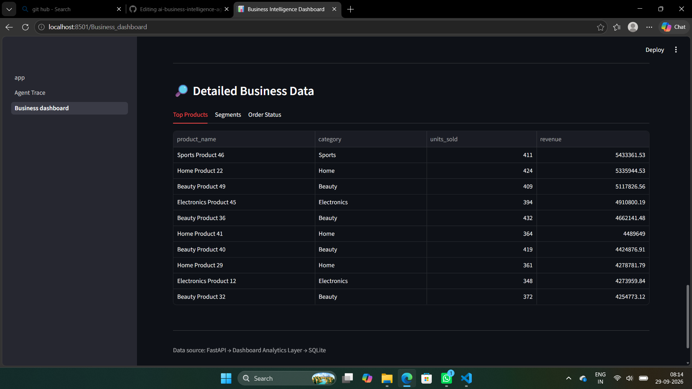
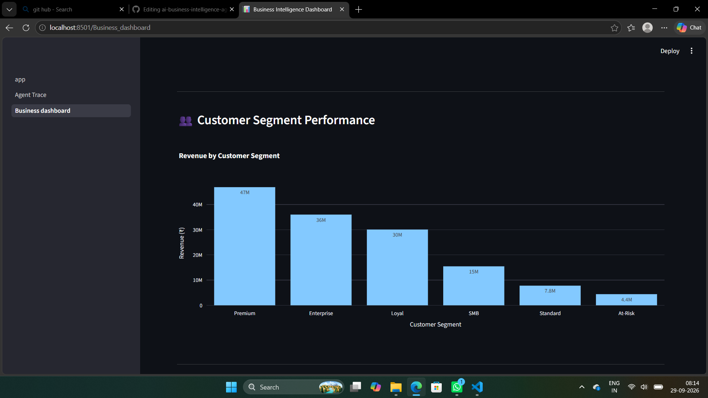
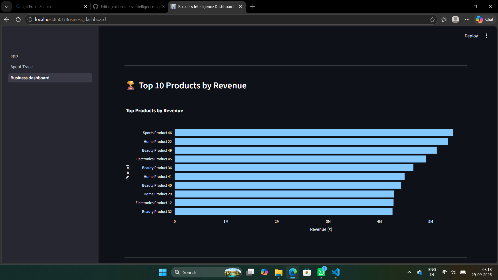

# AI-Powered Autonomous Business Intelligence & Decision Support Agent

> An industry-oriented AI business intelligence platform that combines LLM-powered agent planning, tool calling, SQL intelligence, data analysis, machine learning, RAG, conversational memory, and evidence-grounded decision support.

## 🚀 Overview

The AI-Powered Autonomous Business Intelligence & Decision Support Agent is a production-oriented AI system designed to help business users analyze data and obtain actionable insights using natural language.

Instead of requiring users to manually write SQL queries or navigate multiple dashboards, the system accepts business questions such as:

- Why did revenue change this month?
- Which category contributed the most revenue?
- Which products are underperforming?
- Which customer has high churn risk?
- What are the major business risks?
- What changed compared with the previous period?
- What should management investigate?

The agent determines the user's intent, creates an execution plan, selects the appropriate tools, analyzes business data, validates the results, and generates an evidence-grounded response.

## 🎯 Project Goals

- Natural-language business intelligence
- Autonomous agent planning
- Tool calling and workflow orchestration
- Safe SQL execution
- Deterministic business calculations
- Machine learning integration
- Retrieval-Augmented Generation (RAG)
- Conversational memory
- Multi-step reasoning
- Evidence-grounded responses
- FastAPI backend
- Streamlit dashboard
- Automated testing and validation

## 🧠 System Architecture

```text
                         ┌──────────────────────┐
                         │      User Query      │
                         └──────────┬───────────┘
                                    │
                                    ▼
                         ┌──────────────────────┐
                         │   Agent / Planner    │
                         │ Intent + Planning    │
                         └──────────┬───────────┘
                                    │
                                    ▼
                         ┌──────────────────────┐
                         │    Plan Validation   │
                         │ Tool + Input Safety  │
                         └──────────┬───────────┘
                                    │
                                    ▼
                    ┌────────────────────────────────┐
                    │         Tool Router             │
                    └───────────────┬────────────────┘
                                    │
              ┌─────────────────────┼─────────────────────┐
              │                     │                     │
              ▼                     ▼                     ▼
       ┌─────────────┐       ┌─────────────┐       ┌─────────────┐
       │ SQL / Data  │       │ ML Tools    │       │  RAG Search │
       │ Analysis    │       │ Risk Model  │       │ Knowledge   │
       └──────┬──────┘       └──────┬──────┘       └──────┬──────┘
              │                     │                     │
              └─────────────────────┼─────────────────────┘
                                    │
                                    ▼
                         ┌──────────────────────┐
                         │ Evidence Collection  │
                         └──────────┬───────────┘
                                    │
                                    ▼
                         ┌──────────────────────┐
                         │ Answer Synthesis     │
                         │ + Validation         │
                         └──────────┬───────────┘
                                    │
                                    ▼
                         ┌──────────────────────┐
                         │ Evidence-Grounded    │
                         │ Business Answer      │
                         └──────────────────────┘
```

## ✨ Key Features

Autonomous AI Agent

The system transforms natural-language business questions into executable workflows:

Question
   ↓
Intent Detection
   ↓
Planning
   ↓
Tool Selection
   ↓
Tool Execution
   ↓
Evidence Collection
   ↓
Validation
   ↓
Final Answer

## Tool Calling

The agent uses specialized tools for:

. Business analysis
. SQL execution
. Percentage change calculation
. Percentage-of calculation
. Growth-rate calculation
. Margin calculation
. Grouping and aggregation
. Machine learning prediction
. Customer risk prediction
. RAG knowledge search

## Safe SQL Intelligence

The platform supports natural-language-driven SQL analysis while enforcing read-only SQL policies.

Destructive operations such as:

DROP
DELETE
UPDATE
INSERT
ALTER
TRUNCATE
CREATE
REPLACE
ATTACH
DETACH
PRAGMA

are blocked.

Only approved read-oriented queries such as SELECT and WITH are allowed.

## Business Intelligence Analysis

The system can analyze:

. Revenue trends
. Category performance
. Product performance
. Customer segments
. Order statuses
. Business KPIs
. Revenue drivers
. Period-over-period changes

## Machine Learning Integration

The platform integrates ML predictions into the agent workflow.
Example:

Customer Risk Prediction
        ↓
Risk Probability
        ↓
Risk Band
        ↓
Business Interpretation
        ↓
Relevant Knowledge Retrieval

## Retrieval-Augmented Generation

RAG is used for knowledge-oriented questions and policy/context retrieval.

Numerical business calculations remain grounded in structured business data rather than being generated by the LLM.

## Multi-Step Reasoning

The agent can execute multiple tools when a question requires a multi-step workflow.

Business Question
       ↓
Calculate Metrics
       ↓
Analyze Business Data
       ↓
Collect Evidence
       ↓
Generate Decision Support

## Conversational Memory

The agent maintains conversation context.
Example:
User:
Why did revenue change this month?

Agent:
Revenue increased by 7.37%.

User:
Which category contributed most?

Agent:
Beauty generated the highest revenue.

## Session-Aware API Memory

The API supports session-based conversations:
{
  "session_id": "demo-session",
  "question": "Why did revenue change this month?"
}

Requests using the same session_id reuse the same agent instance and conversation memory.

Different session IDs remain isolated.

Current implementation uses in-memory session storage. Sessions reset when the application process restarts.

## Evidence-Grounded Answer Validation

Before an answer is returned, numerical claims are validated against collected evidence.

The validator handles:

. Unsupported numerical claims
. Percentages and decimals
. Formatted numbers
. Product identifiers
. Missing evidence
. Empty answers

## Execution Observability

Agent execution generates trace events such as:

PLAN_CREATED
PLAN_VALIDATED
TOOL_STARTED
TOOL_COMPLETED
EVIDENCE_ADDED
FINAL_ANSWER_GENERATED
ANSWER_VALIDATED
MEMORY_TURN_SAVED
EXECUTION_COMPLETED

## Error Recovery

Tool execution includes validation and controlled retry behavior.

The agent can detect failed tool results and attempt recovery within bounded limits.

## 🏗️ Project Structure

ai-business-intelligence-agent/
│
├── api/
│   ├── main.py
│   ├── schemas.py
│   └── routes/
│       ├── agent.py
│       └── dashboard.py
│
├── dashboard/
│   └── app.py
│
├── genai/
│   ├── llm_client.py
│   ├── mock_llm.py
│   ├── plan_validator.py
│   ├── schemas.py
│   └── synthesis.py
│
├── src/
│   ├── agent/
│   │   ├── agent.py
│   │   ├── memory.py
│   │   └── session_memory.py
│   │
│   └── tools/
│       ├── registry.py
│       └── router.py
│
├── tests/
│   ├── test_agent.py
│   ├── test_api.py
│   ├── test_memory.py
│   └── test_session_memory.py
│
├── README.md
└── requirements.txt

## 🛠️ Tech Stack

Programming
. Python 3.12

## AI / ML

. Large Language Models
. Agentic AI
. Tool Calling
. Machine Learning
. RAG
. Semantic Knowledge Retrieval

## Data

. Pandas
. NumPy
. SQL
. Structured Business Data

## Backend

FastAPI
Pydantic
Uvicorn

## Frontend

Streamlit

## Testing
Pytest

## Engineering

. Git
. GitHub
. Modular Architecture
. Validation and Guardrails
. Execution Tracing
. Error Recovery

## 📊 Business Dataset

The application works with structured business information including:

. Customers
. Orders
. Products
. Customer Segments
. Business Metrics

## Example KPIs:

Total Revenue
Total Orders
Total Customers
Completed Orders
Average Order Value
Return Rate
Cancellation Rate

## 🔌 API

### Health Check

GET /health

### Agent Query

POST /agent/query

Example request:

{
  "session_id": "demo-session",
  "question": "Why did revenue change this month?"
}

## The response contains:

. Trace ID
. Status
. Intent
. Final answer
. Iteration count
. Execution duration
. Evidence
. Execution trace

## Dashboard Summary

GET /dashboard/summary

Returns:

. KPIs
. Revenue trend
. Category revenue
. Top products
. Segment performance
. Order status

## ▶️ Running Locally

Clone the repository

cd ai-business-intelligence-agent

## Create virtual environment

python -m venv .venv

## Activate environment

Windows:

.venv\Scripts\activate

## Install dependencies

pip install -r requirements.txt

## Start FastAPI

uvicorn api.main:app --reload

## API:

http://127.0.0.1:8000

## Swagger documentation:

http://127.0.0.1:8000/docs

## Start Streamlit

Open another terminal:

streamlit run dashboard\app.py

## 🧪 Testing

The project includes automated tests covering:

. Agent planning
. Tool execution
. SQL safety
. Business analysis
. Machine learning integration
. RAG
. API endpoints
. Conversation memory
. Session memory
. Answer validation
. Error handling
. Multi-step workflows

## Run the complete test suite:

pytest -q

## Current regression status:

56 passed

## 🔐 Safety & Reliability

The platform includes:

. Read-only SQL validation
. Tool allowlisting
. Plan validation
. Maximum agent iterations
. Tool execution recovery
. Input validation
. Evidence validation
. Numerical answer validation
. Session isolation
. Execution tracing

## 💡 Example Questions

Why did revenue change this month?

Which category generated the highest revenue?

Which products are underperforming?

Which customer has the highest risk?

What are the major business risks?

What changed compared with the previous period?

Which segment generated the most revenue?

What should management investigate?

## 📈 Example Business Insights

Revenue increased by 7.37% compared with the previous period.

Beauty generated the highest category revenue.

Customer risk prediction can identify customers
whose predicted risk exceeds the configured threshold.

All numerical responses are validated against collected evidence before being returned.

## 🧩 Engineering Highlights

LLM
 ↓
Agent Planning
 ↓
Tool Calling
 ↓
SQL Intelligence
 ↓
Data Analysis
 ↓
Machine Learning
 ↓
RAG
 ↓
Evidence Validation
 ↓
Decision Support

The architecture is modular so individual components can be replaced or extended independently.

## 📸 Application Screenshots

### AI Business Analyst

The AI Business Analyst allows users to ask natural-language business questions and receive evidence-grounded answers using SQL analytics, data analysis, machine learning, and business knowledge.



### Evidence-Grounded Analysis

The agent displays the supporting evidence, execution status, intent, iteration count, and response latency for each analysis.



### Agent Execution Trace

The execution trace provides visibility into the agent workflow, including memory retrieval, plan creation, plan validation, tool execution, evidence collection, answer generation, and validation.





### Business Intelligence Dashboard

The executive dashboard provides an overview of revenue, orders, customers, return rate, cancellation rate, and monthly revenue trends.



### Revenue, Categories & Order Status

Revenue by category and order-status distribution provide a high-level view of business performance and operational health.



### Top Products

The dashboard highlights the top products ranked by revenue.



### Customer Segment Performance

Customer segment analysis shows revenue contribution across Premium, Enterprise, Loyal, SMB, Standard, and At-Risk segments.



### Detailed Business Data

Detailed business data tables provide product-level metrics including category, units sold, and revenue.



---

## 🚧 Future Improvements

. Persistent Redis/PostgreSQL conversation memory
. Docker containerization
. Cloud deployment
. Authentication and authorization
. Rate limiting
. Background task processing
. Advanced LLM providers
. Agent evaluation pipelines
. Distributed observability
. Prometheus/Grafana monitoring
. CI/CD automation
. Automated model monitoring

## 📌 Project Status

Portfolio-ready core implementation

The core agent, API, dashboard, memory, RAG/ML integrations, validation, observability, and automated test suite are implemented.

Test Status

56 / 56 tests passing

## 👨‍💻 Author

Aashish

AI/ML • Data Analytics • Python • Machine Learning • Generative AI
